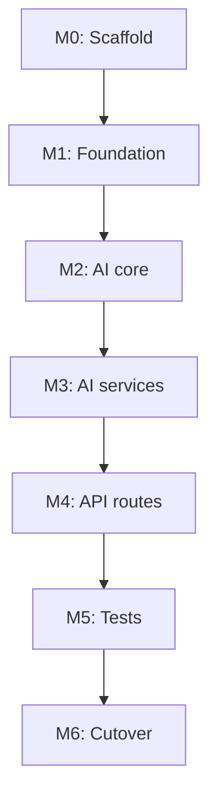

# MockAI Phase 1 Implementation Plan

> **For agentic workers:** Use subagent-driven-development or executing-plans to implement milestone-by-milestone. Check off tasks as completed.

**Goal:** Deliver Stage 0 (foundation) + Stage 1 (Interview Engine V1) as a new `app/` package with clean API, structured AI outputs, and async report generation.

**Architecture:** Big-bang rebuild under `app/`. Legacy root modules deleted in the same release. Build `app/ai/` as the core subsystem using **Pydantic AI** (`OpenAIResponsesModel` + `NativeOutput`) for all structured LLM calls. Wire clean REST routes to domain services. MongoDB + Beanie, greenfield collections. LangChain removed.

**Tech stack:** Python 3.12+, FastAPI, Beanie/Motor, pydantic-settings, **pydantic-ai-slim[openai]**, OpenAI SDK (TTS/audio only), Redis, boto3, Razorpay, pytest + httpx

**Spec:** [phase-1-spec.md](../phase-1-spec.md) (v0.3 locked)

**Estimated duration:** 3–4 weeks (1 engineer)

---

## Prerequisites

Before Milestone 0:

1. Create feature branch: `feat/phase-1-rebuild`.
2. Optional: git worktree for isolated development.
3. Frontend team aware: zero backward compat; API paths in spec §7.

---

## Milestone 0: Scaffold and tooling

**Outcome:** `app/` package is the only application code; pytest configured. No legacy `main.py` at cutover.

### Task 0.1 — Create package skeleton

**Files to create:**

```
app/__init__.py
app/main.py
app/core/__init__.py
app/core/config.py
app/core/logging.py
app/core/errors.py
app/core/security.py
app/core/deps.py
app/db/__init__.py
app/db/client.py
app/db/init.py
app/db/models/__init__.py
tests/conftest.py
tests/test_health.py
.env.example
pyproject.toml OR keep requirements.txt (match repo convention)
```

**Steps:**

1. Create `Settings` in `app/core/config.py` with all env vars currently scattered:
   - `MONGO_URI`, `MONGO_DB_NAME`, `REDIS_URI`, `SECRET_KEY`, `OPENAI_API_KEY`
   - `RAZORPAY_KEY_ID`, `RAZORPAY_KEY_SECRET`, `RAZORPAY_WEBHOOK_SECRET`
   - `AWS_*` / S3 bucket name (replace hardcoded `mockai-resume`)
   - `CORS_ORIGINS` (list, from comma-separated env)
   - `OPENAI_MODEL_FAST`, `OPENAI_MODEL_STRONG`, `OPENAI_TTS_MODEL`, `OPENAI_TTS_VOICE`
   - `MIN_ANSWERS_TO_SUBMIT` (default `4`, configurable — spec §10)

2. `app/main.py`: FastAPI app, CORS from settings, include health route, wire logging middleware stub.

3. `tests/conftest.py`: `AsyncClient` fixture against `app.main:app`.

4. `tests/test_health.py`: assert `GET /` → 200.

5. Run: `pytest tests/test_health.py -v`

**Verify:** `uvicorn app.main:app --reload` starts without import errors.

---

## Milestone 1: Foundation (Stage 0)

**Outcome:** DB init safe, models clean, logging/errors/auth/integrations extracted.

### Task 1.1 — Logging and request ID middleware

**Files:**
- Create: `app/core/logging.py`
- Modify: `app/main.py`

**Implementation:**
- JSON or structured text logs with `request_id` (UUID from header `X-Request-ID` or generated).
- Middleware adds `request_id` to `contextvars` and response header.
- Log method, path, status, duration_ms.

**Verify:** Single request produces log line containing same `request_id` as response header.

---

### Task 1.2 — Global error handling

**Files:**
- Create: `app/core/errors.py`
- Modify: `app/main.py`

**Implementation:**
- `AppError` base with `code`, `message`, `status_code`.
- Handlers for `HTTPException`, `AppError`, validation errors, unhandled → 500 with request_id.
- Consistent body: `{ "error": { "code", "message", "request_id" } }`.

**Verify:** `pytest tests/test_errors.py` — trigger 404 and 422, assert shape.

---

### Task 1.3 — Database client and explicit model registration

**Files:**
- Create: `app/db/client.py`, `app/db/init.py`
- Port models to `app/db/models/` (start with copies, refactor embeds in Task 1.4)

**Replace** `database.py` pattern:

```python
# app/db/init.py
from app.db.models.user import User
from app.db.models.interview import Interview
from app.db.models.payment import Payment
# ... explicit list only

DOCUMENT_MODELS = [User, Interview, Payment, AIRequest, AptitudeQuestion, UserAptitude, ...]
# Exclude Company, Employee (Stage 2)

async def init_db(settings: Settings) -> None:
    client = AsyncIOMotorClient(settings.mongo_uri)
    await init_beanie(database=client[settings.mongo_db_name], document_models=DOCUMENT_MODELS)
```

**Verify:** Startup logs list of registered models; no `eval()` anywhere (`rg eval app/` → empty).

---

### Task 1.4 — Fix embedded Document classes

**Files:**
- Create: `app/db/models/embeds/` — `speech.py`, `review.py`, `question.py`
- Modify: `app/db/models/interview.py`

**Action:** Convert `SpeechAnalysis`, `QuestionResponse`, `FreeReview`, nested review types from `Document` → `BaseModel`. Only `Interview`, `User`, `Payment`, etc. remain `Document`.

**Verify:** Beanie init succeeds; existing data readable (spot-check one interview doc in dev DB).

---

### Task 1.5 — Security module

**Files:**
- Create: `app/core/security.py` (port from `auth.py`)
- Create: `app/core/deps.py` — `get_current_user`, `get_redis`, `get_settings`

**Verify:** Unit test JWT create/decode roundtrip.

---

### Task 1.6 — Integration modules

**Files to create** (extract from `services/interview_service.py`, `services/users_service.py`, `openai_utils.py`):

| File | Extract from |
|------|--------------|
| `app/integrations/whisper.py` | Whisper HTTP upload (from `transcribe` route) |
| `app/integrations/storage.py` | S3 upload/download |
| `app/integrations/tts.py` | **New** OpenAI TTS (replace Google; direct SDK, not Pydantic AI) |
| `app/integrations/razorpay.py` | Razorpay client + verify signature |
| `app/integrations/email.py` | SendGrid/Brevo from users_service |

**Note:** Structured LLM calls go through `app/ai/client.py` (Pydantic AI). No `app/integrations/openai.py` for chat/responses.

**Verify:** Each integration has a thin test with mocked HTTP/SDK (no real API keys in tests).

---

### Task 1.7 — Trim requirements.txt

**Remove:** langchain*, streamlit, pandas, scikit-learn, google-cloud-texttospeech (if TTS migrated), unused science stack.

**Keep:** fastapi, uvicorn, beanie, motor, pydantic, pydantic-settings, pydantic-ai-slim[openai], openai, redis, boto3, razorpay, httpx, pytest, pytest-asyncio, python-jose, passlib, etc.

**Verify:** Fresh venv `pip install -r requirements.txt && pytest tests/ -v`

---

### Task 1.8 — Deploy manifest cleanup

**Files:** `deploy/deployment.yaml`, `deploy/service.yaml`

**Action:** Rename prepsom → mockai labels/images (values you provide); remove google-sa volume mount if TTS no longer needs it.

**Verify:** Manifest validates (`kubectl apply --dry-run=client` if cluster available).

---

## Milestone 2: AI layer core

**Outcome:** Pydantic AI wrapper + AIRequest tracking + prompt loader.

### Task 2.1 — AIRequest model

**Files:**
- Create: `app/db/models/ai_request.py`
- Update: `app/db/init.py` model list

---

### Task 2.2 — Pydantic AI output schemas

**Files:**
- Create: `app/ai/schemas/interview_plan.py`
- Create: `app/ai/schemas/question_set.py`
- Create: `app/ai/schemas/evaluation.py`
- Create: `app/ai/schemas/report.py` — includes `FreeReportOutput`, `PaidReportOutput`, `RecruiterScorecard`

**Derive fields from:**
- Current `FreeReview` / `PaidReview` shapes (what frontend displays today)
- Roadmap rubric/evidence requirements
- Phase 1 spec §9.3

**Minimum types:**

```python
# question_set.py
class PlannedQuestion(BaseModel):
    question_id: str
    text: str
    competency: str
    difficulty: Literal["easy", "medium", "hard"]
    intent: str
    backup_question: str | None
    follow_up_policy: str

class QuestionSet(BaseModel):
    schema_version: Literal["v1"] = "v1"
    questions: list[PlannedQuestion]
```

(Spec full definitions during implementation — match report UI components in `mockai-frontend/src/components/InterviewReport/`.)

---

### Task 2.3 — Prompt files v1

**Files:**
- Create: `app/ai/prompts/planner/v1.md`
- Create: `app/ai/prompts/strategist/v1.md`
- Create: `app/ai/prompts/evaluator/v1.md`
- Create: `app/ai/prompts/conductor/v1.md`
- Create: `app/ai/prompts/report/v1.md`
- Create: `app/ai/prompts/guardrails/v1.md`

**Action:** Port intent from `openai_utils.py` prompts into versioned markdown with stable prefix sections. Mark dynamic placeholders `{job_role}`, `{resume_summary}`, etc.

---

### Task 2.4 — Pydantic AI client + tracking

**Files:**
- Create: `app/ai/client.py`
- Create: `app/ai/tracking.py`
- Create: `app/ai/prompts/loader.py` — load markdown by `{service}/{version}`

**Spike first (½ day):**
- Confirm `OpenAIResponsesModel` + `NativeOutput` works with target schemas
- Confirm `result.usage.cache_read_tokens` populates for stable-prefix prompts
- Confirm `retries={"output": 1}` maps to `AIRequest.validation_status` (`valid` / `repaired` / `failed`)

**Implementation (`app/ai/client.py`):**

```python
from pydantic import BaseModel
from pydantic_ai import Agent, NativeOutput
from pydantic_ai.models.openai import OpenAIResponsesModel

async def structured_completion[T: BaseModel](...) -> tuple[T, AIRequest]:
    agent = Agent(
        OpenAIResponsesModel(model),
        instructions=system_prompt,
        output_type=NativeOutput(output_schema, strict=True),
        retries={"output": 1},
    )
    result = await agent.run(user_content)
    # tracking.record(result, task_type, prompt_version, schema_version, ...)
    return result.output, ai_request
```

**Behavior:**
1. Load system prompt from `prompts/loader.py`.
2. Run Pydantic AI agent with `NativeOutput` (OpenAI native structured outputs).
3. Map `result.usage` → `AIRequest` token fields (`input_tokens`, `output_tokens`, `cache_read_tokens`).
4. Persist `AIRequest` via `tracking.py`.
5. Return parsed model + AIRequest id.

**Verify:** `tests/test_ai/test_client.py` — use Pydantic AI `TestModel` or `FunctionModel`; assert AIRequest row created; assert repair path sets `validation_status=repaired`.

---

## Milestone 3: AI services

**Outcome:** Each service unit-tested with mocked Pydantic AI client (`TestModel` / patch `structured_completion`).

### Task 3.1 — InterviewPlanner

**Files:** `app/ai/planners/interview_planner.py`

**Pattern:** Load `prompts/planner/v1.md` → `structured_completion(..., output_schema=InterviewPlan)`.

**Verify:** Test with fixture resume → `InterviewPlan` validates, competencies non-empty.

---

### Task 3.2 — QuestionStrategist

**Files:** `app/ai/strategists/question_strategist.py`

**Behavior:** Accept plan + previous question texts; output 10 questions (or configurable count) including intro; dedupe against prior.

**Verify:** Test dedupes when previous questions passed in.

---

### Task 3.3 — AnswerEvaluator

**Files:** `app/ai/evaluators/answer_evaluator.py`

**Behavior:** Replace `openai_utils.analyze_audio` LangChain path. Combine Whisper transcript + audio metrics + structured evaluation.

**Verify:** Output includes `rubric_signals[].evidence` non-empty for scored items.

---

### Task 3.4 — StaticConductor

**Files:** `app/ai/conductors/static_conductor.py`

**Behavior:** After weak evaluation (`follow_up_recommended`), decide follow-up question text.

**Verify:** Weak fixture answer → `ask_follow_up=True`.

---

### Task 3.5 — QualityGuardrails

**Files:** `app/ai/guardrails/quality_guardrails.py`

**Verify:** Fixture discriminatory question → guardrail flags block.

---

### Task 3.6 — ReportGenerator

**Files:** `app/ai/reports/report_generator.py`

**Behavior:**
- `generate_free_report(interview_id)` → `FreeReportOutput`
- `generate_paid_report(interview_id)` → `PaidReportOutput` + `RecruiterScorecard` (stored on interview; not exposed via API)
- Pure async functions callable from BackgroundTasks
- Submit validation uses `settings.min_answers_to_submit`

**Verify:** Tests with mocked interview fixture (4+ answered turns).

---

## Milestone 4: Domain services and API routes

**Outcome:** New REST API wired to AI engine; billing bug fixed.

### Task 4.1 — Auth routes

**Files:**
- Create: `app/services/auth_service.py`
- Create: `app/api/routes/auth.py`
- Port logic from: `services/users_service.py` (OTP send/verify/signup)

**Routes:** `POST /auth/otp/send`, `POST /auth/otp/verify`

---

### Task 4.2 — User routes

**Files:**
- Create: `app/services/user_service.py`
- Create: `app/api/routes/users.py`
- Port: profile, resume upload, dashboard (optional in Phase 1), feedback

**Routes:** `GET/PATCH /users/me`, `POST /users/me/resume`

---

### Task 4.3 — Interview service (core)

**Files:**
- Create: `app/services/interview_service.py`
- Create: `app/api/routes/interviews.py`

**Key flows:**

| Route | Service method | AI calls |
|-------|----------------|----------|
| `POST /interviews` | `create_interview` | none |
| `POST /interviews/{id}/questions` | `generate_questions` | Planner → Strategist → Guardrails |
| `POST /interviews/{id}/turns/{turn_id}/audio` | `process_turn_audio` | Whisper → Evaluator → optional Conductor |
| `POST /interviews/{id}/submit` | `submit_interview` | enqueue BackgroundTask: ReportGenerator free |
| `GET /interviews/{id}/report` | `get_report` | none (read status + report) |
| `POST /interviews/{id}/report/paid` | `trigger_paid_report` | enqueue BackgroundTask: paid |

**Submit behavior change:** Return **202** with `{ "report_status": "pending" }` immediately.

**Interview model:** Add `free_report_status`, `paid_report_status`, store new schema embeds.

---

### Task 4.4 — Billing routes

**Files:**
- Create: `app/services/billing_service.py`
- Create: `app/api/routes/billing.py`
- Port from: `services/interview_service.py` (create_order, verify_order, webhook)

**Routes:**
- `POST /billing/orders`
- `POST /billing/verify`
- `POST /billing/webhook`
- `GET /billing/interviews/{id}/status` ← **fixes `/interview/interview/status` bug**

---

### Task 4.5 — TTS route

**Files:** `app/api/routes/tts.py` OR include in interviews router

**Route:** `POST /tts/synthesize` → `integrations/tts.py`

**Verify:** Returns audio bytes; content-type `audio/mpeg`.

---

### Task 4.6 — Aptitude port

**Files:**
- Create: `app/api/routes/aptitude.py`
- Create: `app/services/aptitude_service.py`
- Port models: `app/db/models/aptitude_question.py`, `app/db/models/user_aptitude.py`
- Port from: `services/aptitude_service.py` (reference only; delete legacy in M5)

**Do not port:** `services/company_service.py`, `models/company.py`, `models/employee.py` (Stage 2).

---

### Task 4.7 — Wire routers in main

**Files:** `app/main.py`

```python
app.include_router(auth_router, prefix="/auth", tags=["auth"])
app.include_router(users_router, prefix="/users", tags=["users"])
app.include_router(interviews_router, prefix="/interviews", tags=["interviews"])
app.include_router(billing_router, prefix="/billing", tags=["billing"])
app.include_router(tts_router, prefix="/tts", tags=["tts"])
app.include_router(aptitude_router, prefix="/aptitude", tags=["aptitude"])
```

**Verify:** OpenAPI at `/docs` lists all new paths. No `/company/*` routes.

---

## Milestone 5: Tests, legacy deletion, and cutover

### Task 5.1 — API integration tests

**Files:**
- `tests/test_api/test_auth.py`
- `tests/test_api/test_interviews.py`
- `tests/test_api/test_billing.py`

**Pattern:** Mock OpenAI + Whisper; use test Mongo (or dev DB with pytest marker). AI tests use Pydantic AI `TestModel` where appropriate.

**Critical paths:**
1. OTP → JWT
2. Create interview → generate questions (mocked AI)
3. Upload audio turn (mocked Whisper + evaluator)
4. Submit → 202 → poll report status
5. Payment status route
6. Submit rejected when answers `< MIN_ANSWERS_TO_SUBMIT`

---

### Task 5.2 — Big-bang delete legacy code

**After all tests pass**, remove in one commit:

```
main.py
auth.py
database.py
openai_utils.py
schemas.py
common_utils.py
models/           # entire directory
services/         # entire directory
logging.conf      # replaced by app/core/logging.py
```

**Update:**
- `Dockerfile` → `CMD uvicorn app.main:app --host 0.0.0.0 --port 8000`
- `start.sh` → same entrypoint
- `deploy/deployment.yaml` → MockAI naming; remove `google-sa` volume if unused

**Verify:**
- `rg langchain` → no matches
- `rg "eval(" app/` → no matches
- `test -f main.py` → fails (file gone)
- `pytest tests/ -v` → all pass

---

## Milestone 6: Production readiness checklist

- [ ] `.env.example` complete; README updated with `uvicorn app.main:app`
- [ ] All spec §11 acceptance criteria checked
- [ ] Frontend/API migration table shared (spec §7.1)
- [ ] Staging deploy smoke test: full interview lifecycle on empty DB
- [ ] Monitor `ai_requests` collection for token usage / error rates first 24h
- [ ] `RecruiterScorecard` present on paid interviews in DB; confirm no route exposes it

---

## Suggested execution order (summary)



| Week | Focus |
|------|-------|
| 1 | M0 + M1 (config, db, models, integrations) |
| 2 | M2 + M3 (AI client, schemas, all 6 services) |
| 3 | M4 (routes, billing fix, async reports) |
| 4 | M5 + M6 (tests, legacy removal, staging) |

---

## Risks and mitigations

| Risk | Mitigation |
|------|------------|
| Pydantic AI + OpenAIResponsesModel edge cases | Spike in Task 2.4 before building all services |
| `cache_read_tokens` not surfaced as expected | Verify in spike; log raw usage in AIRequest.details if needed |
| Async reports lost on process restart | Accept for Phase 1; document; Temporal in later stage |
| Frontend blocked until API client updated | Parallel frontend sprint using spec §7.1 mapping |
| Scope creep into Stage 2 company features | Do not port `/company/*`; strict spec §6.2 |
| Big-bang deploy failure | All tests green before Task 5.2; staging smoke test before prod |

---

## Self-review (spec coverage)

| Spec requirement | Plan task |
|------------------|-----------|
| pydantic-settings | 0.1 |
| Structured logging + request ID | 1.1 |
| Global errors | 1.2 |
| Remove eval, explicit models | 1.3 |
| Embedded → BaseModel | 1.4 |
| Auth → security.py | 1.5 |
| Integrations split | 1.6 |
| Payment status bug | 4.4 |
| .env.example | 0.1 |
| LangChain removal | 1.7, 5.2 |
| AIRequest tracking | 2.1, 2.4 |
| Pydantic AI client (app/ai only) | 2.4, 3.1–3.6 |
| Structured outputs + repair | 2.4 |
| Async submit 202 | 4.3 |
| OpenAI TTS | 1.6, 4.5 |
| Quality guardrails | 3.5 |
| RecruiterScorecard schema + storage | 2.2, 3.6 |
| MIN_ANSWERS_TO_SUBMIT | 0.1, 3.6, 4.3 |
| Aptitude port | 4.6 |
| Big-bang legacy delete | 5.2 |
| Basic tests | 5.1 |

**All spec decisions locked (v0.3).** No remaining open questions.

---

## Execution options

**Plan saved to:** `docs/plans/phase-1-implementation-plan.md`

1. **Subagent-driven** — one milestone per subagent with review between milestones (recommended).
2. **Inline** — implement sequentially in this session with checkpoints after M1, M3, M5.

Say which execution mode you prefer to begin Milestone 0.
